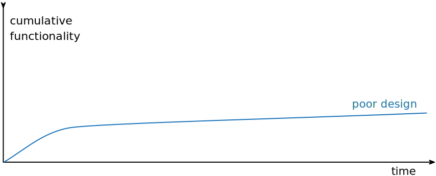
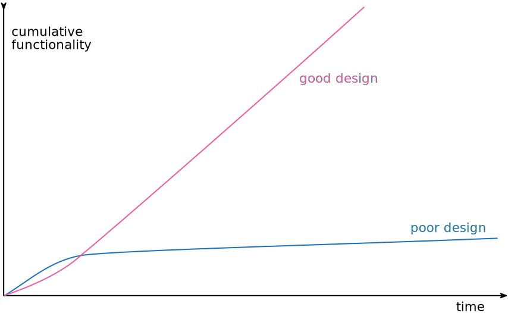

# 为何重构

我不想把重构说成是包治百病的万灵丹，它绝对不是所谓的“银弹”。不过它的确很有价值，虽不是一颗银子弹却是一把“银钳子”，可以帮助你始终良好地控制自己的代码。重构是个工具，它可以（并且应该）用于以下几个目的。

## 重构改进软件设计

如果没有重构，程序的内部设计——或者叫架构——会逐渐腐败变质。当人们只为短期目的而修改代码，他们经常没有完全理解整体设计，于是程序逐渐失去了自己的结构。程序员越来越难通过阅读源码而理解原来的设计。代码结构的流失是累积性的。越难看出代码所代表的设计意图，就越难保护其中设计，于是设计就腐败得越快。经常性的重构可以帮助代码维持自己该有的形态。

完成同样一件事，设计不良的程序往往需要更多代码，这常常是因为代码在不同的地方使用完全相同的语句做同样的事。因此改进设计的一个重要方向就是消除重复代码。代码量减少并不会使系统运行更快，因为这对程序的运行轨迹几乎没有任何明显影响。然而代码量减少将使未来可能的程序修改动作容易得多。代码越多，正确的修改就越困难，因为有更多代码需要理解。我在这儿做了点修改，系统却不如预期那样工作，因为我没有修改另一处——那儿的代码做着几乎完全一样的事情，只是所处环境略有不同。如果消除重复代码，我就可以确定所有事物和行为在代码中只表述一次，这正是优秀设计的根本。

## 重构使软件更容易理解

所谓程序设计，很大程度上就是与计算机交谈：我编写代码告诉计算机做什么事，它的响应则是精确按照你的指示行动。一言以蔽之，我所做的就是填补“想要它做什么”和“告诉它做什么”之间的缝隙。编程的核心就在于“准确说出我所要的”。然而别忘了，除了计算机外，源码还有其他读者：几个月之后可能会有另一位程序员尝试读懂我的代码并做一些修改。我们很容易忘记这第二位读者，但他才是最重要的。计算机是否多花了几个CPU时钟周期来编译，又有什么关系呢？如果一个程序员花费一周时间来修改某段代码，那才要命呢——如果他理解了我的代码，这个修改原本只需一小时。

问题在于，当我努力让程序运转的时候，不会想到未来出现的那个开发者。是的，我们应该改变一下开发节奏，让代码变得更易理解。重构可以帮助我们让代码更易读。一开始进行重构时，代码可以正常运行，但结构不够理想。在重构上花一点点时间，就可以让代码更好地表达自己的用途——更清晰地说出我想要做的。

关于这一点，我没必要表现得多么无私。很多时候那个未来的开发者就是我自己。此时重构就显得尤其重要了。我是个很懒惰的程序员，我的懒惰表现形式之一就是：总是记不住自己写过的代码。事实上，对于任何能够立刻查阅的东西，我都故意不去记它，因为我怕把自己的脑袋塞爆。我总是尽量把该记住的东西写进程序里，这样我就不必记住它了。这么一来，下班后我还可以喝上两杯Maudite啤酒，不必太担心它杀光我的脑细胞。

## 重构帮助找到bug

对代码的理解，可以帮助我找到bug。我承认我不太擅长排错。有些人只要盯着一大段代码就可以找出里面的bug，我可不行。但我发现，如果对代码进行重构，我就可以深入理解代码的作为，并立即把新的理解反馈回去。搞清楚程序结构的同时，我也清楚了自己所做的一些假设，于是想不把bug揪出来都难。

这让我想起了Kent Beck经常形容自己的一句话：“我不是个特别好的程序员，我只是个还不错的程序员，但有着一些特别好的习惯。”重构能够帮助我更有效地写出强健的代码。

## 重构提高编程速度

终于，前面的一切都归结到了这最后一点：重构帮助你更快速地开发程序。

听起来有点违反直觉。当我谈到重构，人们很容易看出它能够提高质量。改善设计、提升可读性、减少错误，这些都能提高质量。但花在重构上的时间，难道不是在降低开发速度吗?

当我跟那些在一个系统上工作较长时间的软件开发者们交谈时，经常会听到这样的故事：一开始他们进展很快，但如今想要添加一个新功能需要的时间就要长得多。他们需要花越来越多的时间去考虑如何把新功能塞进现有的代码库，不断蹦出来的bug修复起来也越来越慢。代码库看起来就像补丁摞补丁，需要细致的考古工作才能弄明白整个系统是如何工作的。这份负担不断拖慢新增功能的速度，以至于程序员们恨不得从头开始重写整个系统。

下面这幅图可以描绘他们经历的困境：

但有些团队的境遇则截然不同。他们添加新功能的速度越来越快，因为他们能利用已有的功能，基于已有的功能快速构建新功能。

两种团队的区别就在于软件的内部质量。需要添加新功能时，内部质量良好的软件让我可以很容易地找到在哪里修改、如何修改。良好的模块划分使我只需要理解代码库的一小部分，就可以做出修改。如果代码很清晰，我引入bug的可能性就会变小，即使引入了bug，调试排错也会容易得多。理想情况下，我的代码库会逐步演化成一个平台，在其上可以很容易地构造与其领域相关的新功能。

我把这种现象称为“设计耐久性假说”：通过投入精力改善内部设计，我们增加了软件的耐久性，从而可以更长时间地保持开发的快速。我还无法科学地证明这个理论，所以我说它是一个“假说”。但我的经验、以及我在职业生涯中认识的上百名优秀程序员的经验，都支持这个假说。

二十年前，行业的陈规认为：良好的设计必须在开始编程之前完成，因为一旦开始编写代码，设计就只会逐渐腐败。重构改变了这个图景。现在我们可以改善已有代码的设计，因此我们可以先做一个设计，然后不断改善它，哪怕程序本身的功能也在不断发生着变化。由于预先做出良好的设计非常困难，想要既体面又快速地开发功能，重构必不可少。
